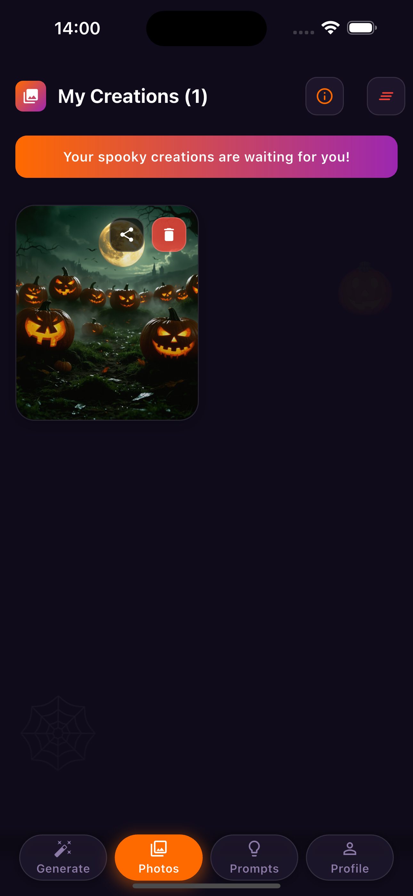
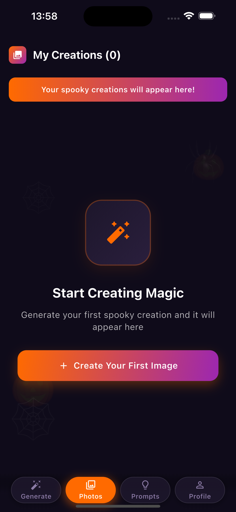
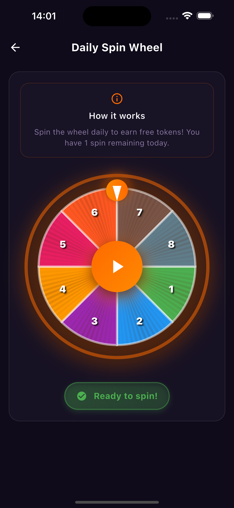
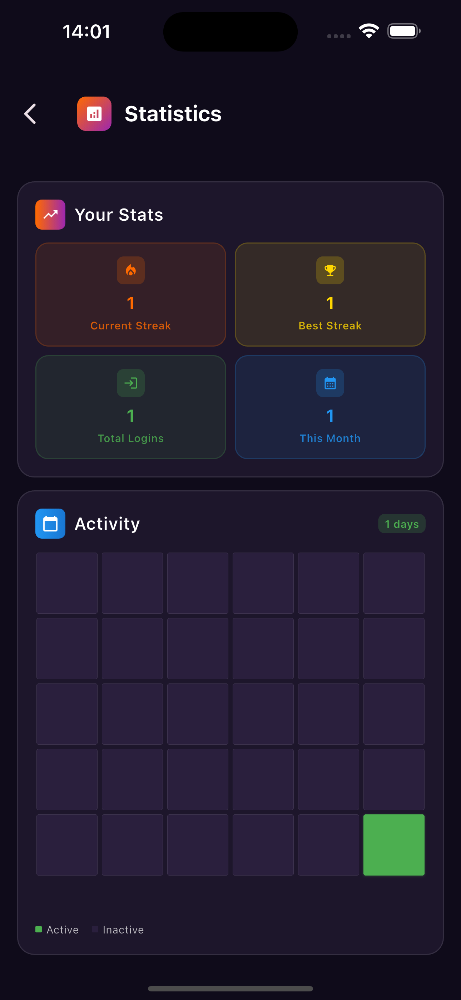

# 🎃 SpookyAI

<div align="center">
  
  
  <h2>✨ Transform Your Photos into Spooky Halloween Masterpieces ✨</h2>
  
  <p style="font-size: 18px; color: #666; margin: 20px 0;">
    AI-powered image generation meets Halloween magic! Create stunning spooky transformations with the power of artificial intelligence.
  </p>
  
  <div style="display: flex; justify-content: center; gap: 15px; margin: 20px 0;">
    
    
    
    
  </div>
</div>

---

## 🚀 Quick Start

<div align="center">
  <div style="background: linear-gradient(135deg, #667eea 0%, #764ba2 100%); padding: 30px; border-radius: 20px; margin: 30px 0; color: white;">
    <h3 style="margin: 0 0 15px 0; font-size: 24px;">🎯 Get Started in 3 Steps</h3>
    <div style="display: flex; justify-content: space-around; margin: 20px 0;">
      <div style="text-align: center; flex: 1;">
        <div style="background: rgba(255,255,255,0.2); border-radius: 50%; width: 60px; height: 60px; display: flex; align-items: center; justify-content: center; margin: 0 auto 10px; font-size: 24px;">1️⃣</div>
        <p style="margin: 0; font-size: 16px;"><strong>Upload Photo</strong><br>Choose your image</p>
      </div>
      <div style="text-align: center; flex: 1;">
        <div style="background: rgba(255,255,255,0.2); border-radius: 50%; width: 60px; height: 60px; display: flex; align-items: center; justify-content: center; margin: 0 auto 10px; font-size: 24px;">2️⃣</div>
        <p style="margin: 0; font-size: 16px;"><strong>Describe Vision</strong><br>Tell AI what you want</p>
      </div>
      <div style="text-align: center; flex: 1;">
        <div style="background: rgba(255,255,255,0.2); border-radius: 50%; width: 60px; height: 60px; display: flex; align-items: center; justify-content: center; margin: 0 auto 10px; font-size: 24px;">3️⃣</div>
        <p style="margin: 0; font-size: 16px;"><strong>Get Magic</strong><br>AI creates masterpiece</p>
      </div>
    </div>
  </div>
</div>

---

## ✨ Key Features

<div style="display: grid; grid-template-columns: repeat(auto-fit, minmax(300px, 1fr)); gap: 20px; margin: 30px 0;">

<div style="background: #f8f9fa; padding: 25px; border-radius: 15px; border-left: 5px solid #ff6b6b;">
  <h3 style="margin: 0 0 15px 0; color: #ff6b6b;">🤖 AI-Powered Generation</h3>
  <ul style="margin: 0; padding-left: 20px;">
    <li>Text-to-image creation</li>
    <li>Photo transformation</li>
    <li>High-quality results</li>
    <li>Real-time processing</li>
  </ul>
</div>

<div style="background: #f8f9fa; padding: 25px; border-radius: 15px; border-left: 5px solid #4ecdc4;">
  <h3 style="margin: 0 0 15px 0; color: #4ecdc4;">🎃 Halloween Magic</h3>
  <ul style="margin: 0; padding-left: 20px;">
    <li>Spooky themes & effects</li>
    <li>Halloween elements library</li>
    <li>Viral trend transformations</li>
    <li>Seasonal prompts</li>
  </ul>
</div>

<div style="background: #f8f9fa; padding: 25px; border-radius: 15px; border-left: 5px solid #45b7d1;">
  <h3 style="margin: 0 0 15px 0; color: #45b7d1;">📱 Modern Experience</h3>
  <ul style="margin: 0; padding-left: 20px;">
    <li>Intuitive interface</li>
    <li>Smooth animations</li>
    <li>Token-based system</li>
    <li>Secure payments</li>
  </ul>
</div>

<div style="background: #f8f9fa; padding: 25px; border-radius: 15px; border-left: 5px solid #96ceb4;">
  <h3 style="margin: 0 0 15px 0; color: #96ceb4;">🖼️ Image Management</h3>
  <ul style="margin: 0; padding-left: 20px;">
    <li>Local gallery storage</li>
    <li>Easy sharing options</li>
    <li>Export capabilities</li>
    <li>History tracking</li>
  </ul>
</div>

</div>

---

## 📱 App Preview

<div align="center">
  
  ### 🎃 **Complete App Experience - 3x3 Grid**
  
  <div style="background: linear-gradient(135deg, #667eea 0%, #764ba2 100%); padding: 20px; border-radius: 15px; margin: 20px 0; color: white;">
    <h3 style="margin: 0 0 15px 0;">✨ SpookyAI in Action ✨</h3>
    <p style="margin: 0; opacity: 0.9;">Experience the complete journey from start to finish</p>
  </div>
  
  <div style="overflow-x: auto; margin: 20px 0;">
    <table style="margin: 0 auto; border-collapse: collapse; background: white; border-radius: 15px; overflow: hidden; box-shadow: 0 8px 32px rgba(0,0,0,0.1); min-width: 600px;">
    <tr>
      <td style="padding: 12px; text-align: center; background: #f8f9fa; border-right: 1px solid #eee; border-bottom: 1px solid #eee;">
        
        <div style="font-size: 11px; color: #333; margin-top: 8px; font-weight: 600;">🏠 Main Screen</div>
        <div style="font-size: 10px; color: #666; margin-top: 2px;">Home & Navigation</div>
      </td>
      <td style="padding: 12px; text-align: center; background: #f8f9fa; border-right: 1px solid #eee; border-bottom: 1px solid #eee;">
        
        <div style="font-size: 11px; color: #333; margin-top: 8px; font-weight: 600;">🎨 Generation</div>
        <div style="font-size: 10px; color: #666; margin-top: 2px;">AI Processing</div>
      </td>
      <td style="padding: 12px; text-align: center; background: #f8f9fa; border-bottom: 1px solid #eee;">
        
        <div style="font-size: 11px; color: #333; margin-top: 8px; font-weight: 600;">📸 Upload</div>
        <div style="font-size: 10px; color: #666; margin-top: 2px;">Photo Selection</div>
      </td>
    </tr>
    <tr>
      <td style="padding: 12px; text-align: center; background: #f8f9fa; border-right: 1px solid #eee; border-bottom: 1px solid #eee;">
        
        <div style="font-size: 11px; color: #333; margin-top: 8px; font-weight: 600;">✍️ Prompt Input</div>
        <div style="font-size: 10px; color: #666; margin-top: 2px;">Text Description</div>
      </td>
      <td style="padding: 12px; text-align: center; background: #f8f9fa; border-right: 1px solid #eee; border-bottom: 1px solid #eee;">
        
        <div style="font-size: 11px; color: #333; margin-top: 8px; font-weight: 600;">⚙️ Mode Selection</div>
        <div style="font-size: 10px; color: #666; margin-top: 2px;">Generation Options</div>
      </td>
      <td style="padding: 12px; text-align: center; background: #f8f9fa; border-bottom: 1px solid #eee;">
        
        <div style="font-size: 11px; color: #333; margin-top: 8px; font-weight: 600;">🔄 Processing</div>
        <div style="font-size: 10px; color: #666; margin-top: 2px;">AI at Work</div>
      </td>
    </tr>
    <tr>
      <td style="padding: 12px; text-align: center; background: #f8f9fa; border-right: 1px solid #eee;">
        
        <div style="font-size: 11px; color: #333; margin-top: 8px; font-weight: 600;">✨ Generated</div>
        <div style="font-size: 10px; color: #666; margin-top: 2px;">Final Result</div>
      </td>
      <td style="padding: 12px; text-align: center; background: #f8f9fa; border-right: 1px solid #eee;">
        
        <div style="font-size: 11px; color: #333; margin-top: 8px; font-weight: 600;">🖼️ Gallery</div>
        <div style="font-size: 10px; color: #666; margin-top: 2px;">Your Creations</div>
      </td>
      <td style="padding: 12px; text-align: center; background: #f8f9fa;">
        
        <div style="font-size: 11px; color: #333; margin-top: 8px; font-weight: 600;">⚙️ Settings</div>
        <div style="font-size: 10px; color: #666; margin-top: 2px;">App Configuration</div>
      </td>
    </tr>
  </table>
  </div>
  
  <div style="background: linear-gradient(135deg, #4ecdc4 0%, #44a08d 100%); padding: 20px; border-radius: 15px; margin: 20px 0; color: white; text-align: center;">
    <h3 style="margin: 0 0 10px 0;">🎯 User Journey Flow</h3>
    <p style="margin: 0; opacity: 0.9;">From upload to masterpiece - every step is intuitive and delightful</p>
  </div>
  
  <div style="background: #f8f9fa; padding: 15px; border-radius: 10px; margin: 15px 0; border-left: 4px solid #667eea;">
    <p style="margin: 0; color: #666; font-size: 14px;">
      <strong>📱 Mobile-Friendly:</strong> The grid above is fully responsive and scrollable on mobile devices. 
      Each screenshot shows a key step in the SpookyAI experience, from initial setup to final masterpiece creation.
    </p>
  </div>
  
  <div style="background: linear-gradient(135deg, #667eea 0%, #764ba2 100%); padding: 30px; border-radius: 20px; margin: 30px 0; color: white; text-align: center;">
    <h3 style="margin: 0 0 15px 0; font-size: 24px;">✨ Experience the Magic</h3>
    <p style="margin: 0; font-size: 18px; opacity: 0.9;">Transform your photos into spooky Halloween masterpieces with AI-powered magic!</p>
  </div>
  
</div>

---

## 🧭 Detailed Screens & UX Flow

<div style="display: grid; grid-template-columns: repeat(auto-fit, minmax(320px, 1fr)); gap: 24px; margin: 26px 0;">

  <div style="background: #ffffff; border-radius: 16px; box-shadow: 0 10px 30px rgba(0,0,0,0.08); overflow: hidden; border: 1px solid #eee;">
    <div style="background: linear-gradient(135deg, #667eea 0%, #764ba2 100%); color: white; padding: 12px 16px; font-weight: 700;">Home • Photos & Generate</div>
    <div style="padding: 16px;">
      
      <p style="color: #555; margin: 12px 0 8px 0;">Your creative hub. Access recent results, start a new generation, or pick a Halloween theme.</p>
      <ul style="margin: 0 0 0 18px; color: #666;">
        <li>One‑tap start for text‑to‑image or image‑to‑image</li>
        <li>Token balance always visible for clarity</li>
        <li>Premium badge highlights extra perks instantly</li>
      </ul>
    </div>
  </div>

  <div style="background: #ffffff; border-radius: 16px; box-shadow: 0 10px 30px rgba(0,0,0,0.08); overflow: hidden; border: 1px solid #eee;">
    <div style="background: linear-gradient(135deg, #ff9068 0%, #fd746c 100%); color: white; padding: 12px 16px; font-weight: 700;">Empty State • First Use</div>
    <div style="padding: 16px;">
      
      <p style="color: #555; margin: 12px 0 8px 0;">Delightful onboarding when you have no creations yet. Clear actions guide you to your first spooky masterpiece.</p>
      <ul style="margin: 0 0 0 18px; color: #666;">
        <li>Prominent CTA to upload a photo or write a prompt</li>
        <li>Subtle tips about best prompts and themes</li>
        <li>Lightweight visuals keep focus on the main action</li>
      </ul>
    </div>
  </div>

  <div style="background: #ffffff; border-radius: 16px; box-shadow: 0 10px 30px rgba(0,0,0,0.08); overflow: hidden; border: 1px solid #eee;">
    <div style="background: linear-gradient(135deg, #00c6ff 0%, #0072ff 100%); color: white; padding: 12px 16px; font-weight: 700;">Daily Spin • Free Tokens</div>
    <div style="padding: 16px;">
      
      <p style="color: #555; margin: 12px 0 8px 0;">A gamified daily reward. Spin the wheel and instantly receive tokens—perfect for daily engagement.</p>
      <ul style="margin: 0 0 0 18px; color: #666;">
        <li>Instant token grant after the wheel stops</li>
        <li>Premium users unlock the spin and get better momentum</li>
        <li>Elegant pointer and smooth animation for a satisfying feel</li>
      </ul>
    </div>
  </div>

  <div style="background: #ffffff; border-radius: 16px; box-shadow: 0 10px 30px rgba(0,0,0,0.08); overflow: hidden; border: 1px solid #eee;">
    <div style="background: linear-gradient(135deg, #56ab2f 0%, #a8e063 100%); color: white; padding: 12px 16px; font-weight: 700;">Statistics • Streaks & Insights</div>
    <div style="padding: 16px;">
      
      <p style="color: #555; margin: 12px 0 8px 0;">Track your creative journey: streaks, total logins, and highlights that motivate you to create more.</p>
      <ul style="margin: 0 0 0 18px; color: #666;">
        <li>Daily streak visualization encourages consistency</li>
        <li>Lightweight charts render fast and look clean</li>
        <li>Privacy‑friendly: only device‑side aggregates</li>
      </ul>
    </div>
  </div>

</div>

<div style="background: linear-gradient(135deg, #667eea 0%, #764ba2 100%); padding: 26px; border-radius: 18px; color: white; text-align: center;">
  <h3 style="margin: 0 0 10px 0;">Create. Share. Spook the World.</h3>
  <p style="margin: 0; opacity: .95;">From your first prompt to a gallery full of eerie art—SpookyAI makes every step delightful.</p>
</div>

---

## 🛠️ Technical Stack

<div style="display: grid; grid-template-columns: repeat(auto-fit, minmax(250px, 1fr)); gap: 20px; margin: 30px 0;">

<div style="background: linear-gradient(135deg, #667eea 0%, #764ba2 100%); color: white; padding: 25px; border-radius: 15px; text-align: center;">
  <h4 style="margin: 0 0 15px 0;">🎨 Frontend</h4>
  <p style="margin: 0; font-size: 14px;">Flutter • Dart • Material Design • Lottie Animations</p>
</div>

<div style="background: linear-gradient(135deg, #ff6b6b 0%, #ee5a24 100%); color: white; padding: 25px; border-radius: 15px; text-align: center;">
  <h4 style="margin: 0 0 15px 0;">🤖 AI Integration</h4>
  <p style="margin: 0; font-size: 14px;">Stability AI • HTTP API • Image Processing • Prompt Engineering</p>
</div>

<div style="background: linear-gradient(135deg, #4ecdc4 0%, #44a08d 100%); color: white; padding: 25px; border-radius: 15px; text-align: center;">
  <h4 style="margin: 0 0 15px 0;">💾 Storage</h4>
  <p style="margin: 0; font-size: 14px;">SharedPreferences • Secure Storage • Local Gallery • File Management</p>
</div>

<div style="background: linear-gradient(135deg, #96ceb4 0%, #feca57 100%); color: white; padding: 25px; border-radius: 15px; text-align: center;">
  <h4 style="margin: 0 0 15px 0;">💰 Monetization</h4>
  <p style="margin: 0; font-size: 14px;">In-App Purchases • Token System • Payment Processing • Purchase Restoration</p>
</div>

</div>

---

## 🏗️ Architecture

<div align="center">
  <div style="background: #f8f9fa; padding: 30px; border-radius: 20px; margin: 30px 0;">
    <h3 style="margin: 0 0 20px 0;">Clean Architecture Pattern</h3>
    <div style="display: grid; grid-template-columns: repeat(auto-fit, minmax(200px, 1fr)); gap: 20px;">
      <div style="background: white; padding: 20px; border-radius: 10px; border-left: 4px solid #667eea;">
        <h4 style="margin: 0 0 10px 0; color: #667eea;">📁 Core</h4>
        <p style="margin: 0; font-size: 14px; color: #666;">Configuration, Models, Services, Theme, Utils</p>
      </div>
      <div style="background: white; padding: 20px; border-radius: 10px; border-left: 4px solid #ff6b6b;">
        <h4 style="margin: 0 0 10px 0; color: #ff6b6b;">🎯 Features</h4>
        <p style="margin: 0; font-size: 14px; color: #666;">Home, Onboarding, Domain Logic, Presentation</p>
      </div>
      <div style="background: white; padding: 20px; border-radius: 10px; border-left: 4px solid #4ecdc4;">
        <h4 style="margin: 0 0 10px 0; color: #4ecdc4;">🎨 UI Layer</h4>
        <p style="margin: 0; font-size: 14px; color: #666;">Pages, Widgets, State Management, Animations</p>
      </div>
    </div>
  </div>
</div>

---

## 🚀 Getting Started

<div style="background: #f8f9fa; padding: 30px; border-radius: 20px; margin: 30px 0;">

### **📋 Prerequisites**

- Flutter SDK (3.10+)
- Dart SDK (3.0+)
- Android Studio / VS Code
- Stability AI API Key

### **⚙️ Installation**

```bash
# Clone the repository
git clone https://github.com/furkanagess/SpookyAI.git
cd SpookyAI

# Install dependencies
flutter pub get

# Configure API key
cp env.example .env
# Edit .env with your Stability AI API key

# Run the app
flutter run
```

### **🔐 API Configuration**

1. Get your Stability AI API key from [Stability AI Platform](https://platform.stability.ai/)
2. Create `.env` file in project root
3. Add your API key: `STABILITY_API_KEY=your_key_here`
4. Never commit the `.env` file to version control

</div>

---

## 📊 Features Status

<div style="overflow-x: auto; margin: 30px 0;">
  <table style="width: 100%; border-collapse: collapse; background: white; border-radius: 10px; overflow: hidden; box-shadow: 0 4px 20px rgba(0,0,0,0.1);">
    <thead>
      <tr style="background: linear-gradient(135deg, #667eea 0%, #764ba2 100%); color: white;">
        <th style="padding: 15px; text-align: left;">Feature</th>
        <th style="padding: 15px; text-align: left;">Description</th>
        <th style="padding: 15px; text-align: center;">Status</th>
      </tr>
    </thead>
    <tbody>
      <tr style="border-bottom: 1px solid #eee;">
        <td style="padding: 15px;">🎨 Text-to-Image</td>
        <td style="padding: 15px;">Generate from text prompts</td>
        <td style="padding: 15px; text-align: center;"><span style="background: #4ecdc4; color: white; padding: 5px 10px; border-radius: 15px; font-size: 12px;">✅ Complete</span></td>
      </tr>
      <tr style="border-bottom: 1px solid #eee;">
        <td style="padding: 15px;">📸 Image-to-Image</td>
        <td style="padding: 15px;">Transform existing photos</td>
        <td style="padding: 15px; text-align: center;"><span style="background: #4ecdc4; color: white; padding: 5px 10px; border-radius: 15px; font-size: 12px;">✅ Complete</span></td>
      </tr>
      <tr style="border-bottom: 1px solid #eee;">
        <td style="padding: 15px;">🎃 Halloween Themes</td>
        <td style="padding: 15px;">Spooky, eerie effects</td>
        <td style="padding: 15px; text-align: center;"><span style="background: #4ecdc4; color: white; padding: 5px 10px; border-radius: 15px; font-size: 12px;">✅ Complete</span></td>
      </tr>
      <tr style="border-bottom: 1px solid #eee;">
        <td style="padding: 15px;">💰 Token System</td>
        <td style="padding: 15px;">Fair usage with tokens</td>
        <td style="padding: 15px; text-align: center;"><span style="background: #4ecdc4; color: white; padding: 5px 10px; border-radius: 15px; font-size: 12px;">✅ Complete</span></td>
      </tr>
      <tr style="border-bottom: 1px solid #eee;">
        <td style="padding: 15px;">🛒 In-App Purchases</td>
        <td style="padding: 15px;">Token packages & payments</td>
        <td style="padding: 15px; text-align: center;"><span style="background: #4ecdc4; color: white; padding: 5px 10px; border-radius: 15px; font-size: 12px;">✅ Complete</span></td>
      </tr>
      <tr style="border-bottom: 1px solid #eee;">
        <td style="padding: 15px;">📱 Modern UI</td>
        <td style="padding: 15px;">Beautiful, intuitive design</td>
        <td style="padding: 15px; text-align: center;"><span style="background: #4ecdc4; color: white; padding: 5px 10px; border-radius: 15px; font-size: 12px;">✅ Complete</span></td>
      </tr>
    </tbody>
  </table>
</div>

---

## 🤝 Contributing

<div style="background: linear-gradient(135deg, #96ceb4 0%, #feca57 100%); color: white; padding: 30px; border-radius: 20px; margin: 30px 0; text-align: center;">
  <h3 style="margin: 0 0 20px 0;">🌟 We Welcome Contributions!</h3>
  <p style="margin: 0 0 20px 0; font-size: 16px;">Help us make SpookyAI even more amazing</p>
  
  <div style="display: flex; justify-content: center; gap: 20px; flex-wrap: wrap;">
    <div style="background: rgba(255,255,255,0.2); padding: 15px; border-radius: 10px; flex: 1; min-width: 200px;">
      <h4 style="margin: 0 0 10px 0;">🐛 Bug Reports</h4>
      <p style="margin: 0; font-size: 14px;">Found an issue? Let us know!</p>
    </div>
    <div style="background: rgba(255,255,255,0.2); padding: 15px; border-radius: 10px; flex: 1; min-width: 200px;">
      <h4 style="margin: 0 0 10px 0;">✨ Feature Requests</h4>
      <p style="margin: 0; font-size: 14px;">Have an idea? Share it with us!</p>
    </div>
    <div style="background: rgba(255,255,255,0.2); padding: 15px; border-radius: 10px; flex: 1; min-width: 200px;">
      <h4 style="margin: 0 0 10px 0;">💻 Code Contributions</h4>
      <p style="margin: 0; font-size: 14px;">Want to contribute code? Great!</p>
    </div>
  </div>
</div>

---

## 📄 License

<div align="center" style="background: #f8f9fa; padding: 30px; border-radius: 20px; margin: 30px 0;">
  <h3 style="margin: 0 0 15px 0;">📜 MIT License</h3>
  <p style="margin: 0; color: #666;">This project is licensed under the MIT License - see the <a href="LICENSE" style="color: #667eea;">LICENSE</a> file for details.</p>
</div>

---

## 🔗 Links

<div align="center" style="margin: 30px 0;">
  <div style="display: flex; justify-content: center; gap: 20px; flex-wrap: wrap;">
    <a href="https://apps.apple.com/app/spookyai" style="background: linear-gradient(135deg, #667eea 0%, #764ba2 100%); color: white; padding: 15px 25px; border-radius: 10px; text-decoration: none; font-weight: bold;">
      🍎 App Store
    </a>
    <a href="https://play.google.com/store/apps/details?id=com.spookyai.app" style="background: linear-gradient(135deg, #4ecdc4 0%, #44a08d 100%); color: white; padding: 15px 25px; border-radius: 10px; text-decoration: none; font-weight: bold;">
      🤖 Google Play
    </a>
    <a href="https://github.com/furkanagess/SpookyAI" style="background: linear-gradient(135deg, #ff6b6b 0%, #ee5a24 100%); color: white; padding: 15px 25px; border-radius: 10px; text-decoration: none; font-weight: bold;">
      💻 GitHub
    </a>
  </div>
</div>

---

<div align="center" style="background: linear-gradient(135deg, #667eea 0%, #764ba2 100%); color: white; padding: 40px; border-radius: 20px; margin: 30px 0;">
  <h2 style="margin: 0 0 20px 0; font-size: 28px;">🎃 Happy Halloween! 🎃</h2>
  <p style="margin: 0 0 20px 0; font-size: 18px;">Transform your photos into spooky masterpieces with SpookyAI!</p>
  
  <div style="display: flex; justify-content: center; gap: 20px; margin: 20px 0;">
    
    
    
  </div>
  
  <p style="margin: 0; font-size: 16px; opacity: 0.9;">Made with ❤️ and AI magic</p>
</div>
