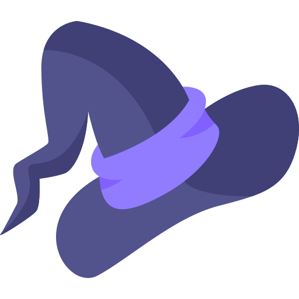

# 🎃 SpookyAI - AI-Powered Halloween Image Generator

<div align="center">
  
  
  **Transform your photos into spooky Halloween masterpieces with AI magic!**
  
  [](https://flutter.dev)
  [](https://dart.dev)
  [](#)
</div>

---

## ✨ Features

### 🎨 **AI Image Generation**

- **Text-to-Image**: Create spooky scenes from text descriptions
- **Image-to-Image**: Transform your photos into Halloween masterpieces
- **Halloween Themes**: Specialized prompts for spooky, eerie, and mysterious effects
- **High Quality**: Generate stunning, high-resolution images

### 🎭 **Halloween Special Features**

- **Ghostface Trend**: Viral TikTok-style transformations
- **Halloween Elements**: Built-in spooky settings, lighting, and effects
- **Prompt Suggestions**: Pre-made Halloween scene ideas
- **Transformation Tips**: Get the best results with expert guidance

### 📱 **User Experience**

- **Modern UI**: Beautiful, intuitive interface with Halloween theming
- **Smooth Animations**: Delightful transitions and micro-interactions
- **Keyboard-Friendly**: Smart keyboard handling for seamless typing
- **Token System**: Fair usage with token-based generation limits

### 🖼️ **Image Management**

- **Local Storage**: Save generated images to your device
- **Gallery View**: Browse all your spooky creations
- **Export Options**: Share your Halloween masterpieces
- **Image History**: Keep track of your favorite generations

---

## 📱 App Screenshots

<div align="center">
  
  ### 🎃 **Main Interface**
  <p align="center">
    
    
    
  </p>
  
  <details>
    <summary><b>🎨 AI Generation Features</b></summary>
    <p align="center">
      
      
      
    </p>
  </details>
  
  <details>
    <summary><b>📸 Results & Gallery</b></summary>
    <p align="center">
      
      
      
    </p>
  </details>
  
  <br>
  
  <div style="background: linear-gradient(135deg, #667eea 0%, #764ba2 100%); padding: 20px; border-radius: 15px; margin: 20px 0;">
    <h3 style="color: white; margin: 0;">✨ Experience the Magic</h3>
    <p style="color: white; margin: 10px 0 0 0; font-size: 16px;">Transform your photos into spooky Halloween masterpieces with AI-powered magic!</p>
  </div>
  
</div>

# <<<<<<< HEAD

## 🔐 Security & API Configuration

### **⚠️ IMPORTANT: API Key Security**

**Never commit API keys to version control!** Follow these steps for secure setup:

### **1. Environment Setup**

```bash
# Copy the environment template
cp env.example .env

# Edit .env file with your actual API key
STABILITY_API_KEY=your_actual_stability_api_key_here
```

### **2. Running with API Keys**

```bash
# Method 1: Command line
flutter run --dart-define=STABILITY_API_KEY=your_api_key_here

# Method 2: VS Code launch.json
{
  "configurations": [
    {
      "name": "SpookyAI",
      "request": "launch",
      "type": "dart",
      "args": ["--dart-define=STABILITY_API_KEY=your_api_key_here"]
    }
  ]
}
```

(🧙‍♂️ Feature Update: Implement onboarding process and in-app purchase functionality)

### **3. Production Deployment**

- Use CI/CD environment variables
- Never hardcode keys in source code
- Rotate keys regularly
- Monitor API usage

---

## 🏗️ Architecture

### **Clean Architecture Pattern**

```
lib/
├── core/                    # Core functionality
│   ├── config/             # API keys and configuration
│   ├── models/             # Data models
│   ├── services/           # Business logic services
│   ├── theme/              # App theming
│   └── utils/              # Utility functions
├── features/               # Feature modules
│   └── home/               # Main app feature
│       ├── domain/         # Business logic
│       └── presentation/  # UI layer
│           ├── pages/      # Screen components
│           └── widgets/    # Reusable UI components
└── main.dart              # App entry point
```

### **Key Technologies**

- **Flutter**: Cross-platform mobile development
- **Provider**: State management
- **HTTP**: API communication
- **Shared Preferences**: Local data storage
- **Image Picker**: Photo selection
- **Lottie**: Smooth animations

---

## 🎯 How to Use

### **1. Text-to-Image Generation**

1. Open the app and select "Text to Image" mode
2. Enter a spooky description (e.g., "Haunted house with ghosts")
3. Choose Halloween elements (setting, lighting, effects)
4. Tap "Generate Image" and wait for your spooky creation!

### **2. Image-to-Image Transformation**

1. Select "Image to Image" mode
2. Upload a photo from your gallery
3. Describe how you want it transformed
4. Let AI work its magic on your photo!

### **3. Ghostface Trend**

1. Enable the Ghostface Trend toggle
2. Upload a selfie or use the preset image
3. Get the viral TikTok-style transformation
4. Share your spooky result!

---

## 🛠️ Development

### **Project Structure**

- **Clean Architecture**: Separation of concerns
- **Provider Pattern**: State management
- **Widget Composition**: Reusable components
- **Service Layer**: API and business logic
- **Theme System**: Consistent design

### **Key Services**

- `StabilityService`: AI image generation
- `TokenService`: Usage tracking
- `ImageStorageService`: Local storage
- `SavedImagesProvider`: State management

### **Customization**

- **Themes**: Halloween-themed UI
- **Animations**: Smooth transitions
- **Responsive**: Works on all screen sizes
- **Accessibility**: Screen reader support

---

## 📊 Features Overview

| Feature               | Description                 | Status |
| --------------------- | --------------------------- | ------ |
| 🎨 Text-to-Image      | Generate from text prompts  | ✅     |
| 📸 Image-to-Image     | Transform existing photos   | ✅     |
| 🎃 Halloween Themes   | Spooky, eerie effects       | ✅     |
| 👻 Ghostface Trend    | Viral TikTok style          | ✅     |
| 💾 Local Storage      | Save generated images       | ✅     |
| 🎭 Prompt Suggestions | Built-in Halloween ideas    | ✅     |
| 🎨 Custom Elements    | Settings, lighting, effects | ✅     |
| 📱 Modern UI          | Beautiful, intuitive design | ✅     |

---

## 🤝 Contributing

We welcome contributions! Please see our [Contributing Guidelines](CONTRIBUTING.md) for details.

### **How to Contribute**

1. Fork the repository
2. Create a feature branch
3. Make your changes
4. Add tests if applicable
5. Submit a pull request

---

## 📄 License

This project is licensed under the MIT License - see the [LICENSE](LICENSE) file for details.

---

## 🔗 Links

- **App Store**: [Download SpookyAI](https://apps.apple.com/app/spookyai)
- **Google Play**: [Get it on Google Play](https://play.google.com/store/apps/details?id=com.spookyai.app)

---

## 🙏 Acknowledgments

- **Stability AI** for the amazing image generation API
- **Flutter Team** for the excellent framework
- **Open Source Community** for inspiration and support

---

<div align="center">
  <h3>🎃 Happy Halloween! 🎃</h3>
  <p>Transform your photos into spooky masterpieces with SpookyAI!</p>
  
  
  
  
</div>
