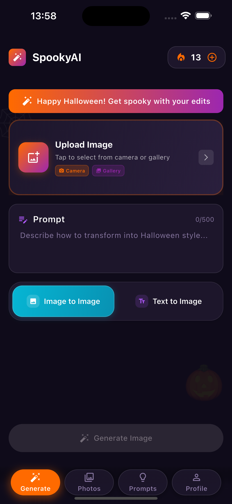
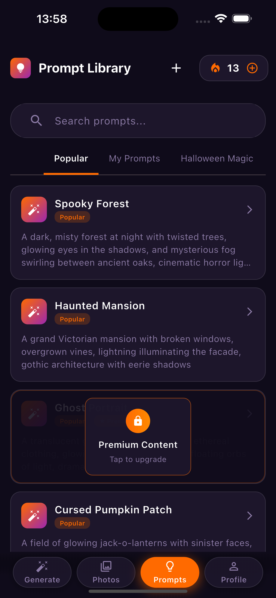
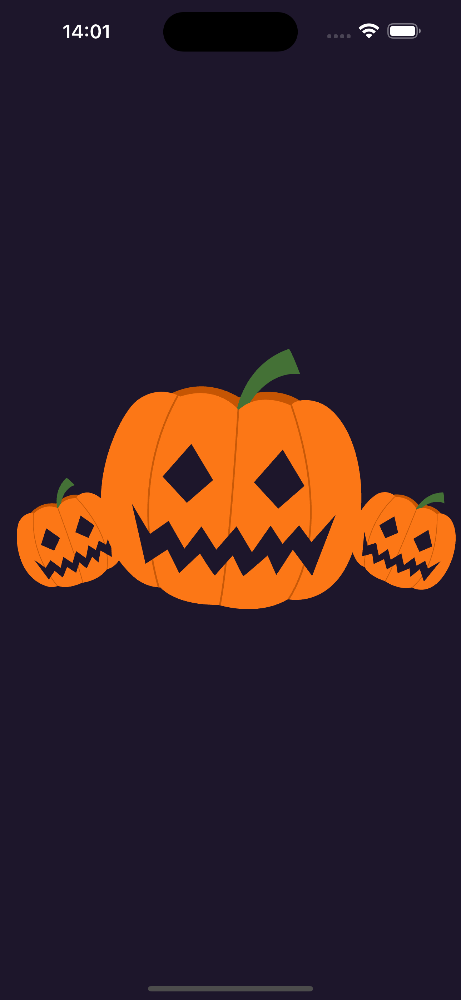
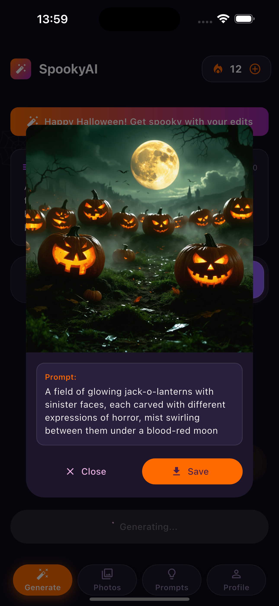
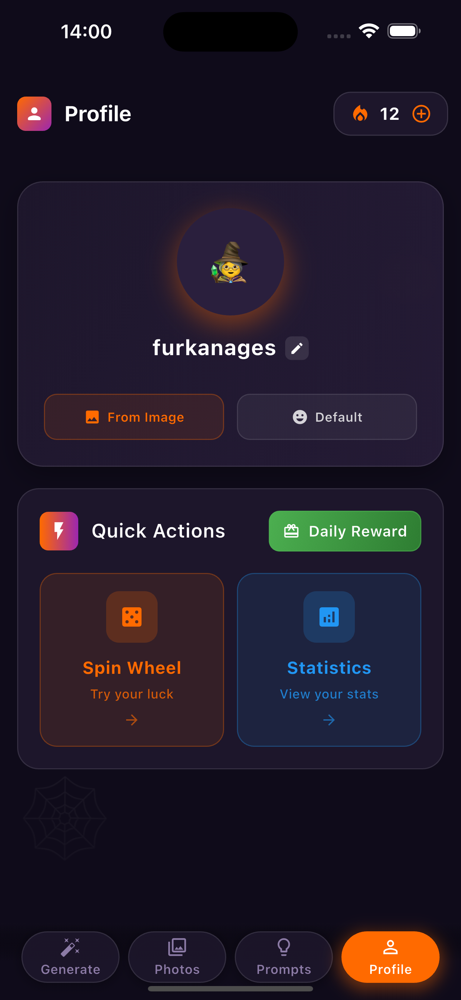

# 🎃 SpookyAI

  
  
  <h2>✨ Transform Your Photos into Spooky Halloween Masterpieces ✨</h2>
  
  

    AI-powered image generation meets Halloween magic! Create stunning spooky transformations with the power of artificial intelligence.
  

  
  

    
    
    
    
  

---

## 🚀 Quick Start

  

    <h3 style="margin: 0 0 15px 0; font-size: 24px;">🎯 Get Started in 3 Steps</h3>
    

      

        
1️⃣

        
<strong>Upload Photo</strong> Choose your image

      

      

        
2️⃣

        
<strong>Describe Vision</strong> Tell AI what you want

      

      

        
3️⃣

        
<strong>Get Magic</strong> AI creates masterpiece

      

    

  

---

## ✨ Key Features

  <h3 style="margin: 0 0 15px 0; color: #ff6b6b;">🤖 AI-Powered Generation</h3>
  <ul style="margin: 0; padding-left: 20px;">
    <li>Text-to-image creation</li>
    <li>Photo transformation</li>
    <li>High-quality results</li>
    <li>Real-time processing</li>
  </ul>

  <h3 style="margin: 0 0 15px 0; color: #4ecdc4;">🎃 Halloween Magic</h3>
  <ul style="margin: 0; padding-left: 20px;">
    <li>Spooky themes & effects</li>
    <li>Halloween elements library</li>
    <li>Viral trend transformations</li>
    <li>Seasonal prompts</li>
  </ul>

  <h3 style="margin: 0 0 15px 0; color: #45b7d1;">📱 Modern Experience</h3>
  <ul style="margin: 0; padding-left: 20px;">
    <li>Intuitive interface</li>
    <li>Smooth animations</li>
    <li>Token-based system</li>
    <li>Secure payments</li>
  </ul>

  <h3 style="margin: 0 0 15px 0; color: #96ceb4;">🖼️ Image Management</h3>
  <ul style="margin: 0; padding-left: 20px;">
    <li>Local gallery storage</li>
    <li>Easy sharing options</li>
    <li>Export capabilities</li>
    <li>History tracking</li>
  </ul>

---

---

## 📱 App Preview

  
  ### 🎃 **Complete App Experience - 3x3 Grid**
  
  

    <h3 style="margin: 0 0 15px 0;">✨ SpookyAI in Action ✨</h3>
    
Experience the complete journey from start to finish

  

  
  

    <table style="margin: 0 auto; border-collapse: collapse; background: white; border-radius: 15px; overflow: hidden; box-shadow: 0 8px 32px rgba(0,0,0,0.1); min-width: 600px;">
    <tr>
      <td style="padding: 12px; text-align: center; background: #f8f9fa; border-right: 1px solid #eee; border-bottom: 1px solid #eee;">
        
        
🠠Photos & Generate

        
Home & Navigation

      </td>
      <td style="padding: 12px; text-align: center; background: #f8f9fa; border-right: 1px solid #eee; border-bottom: 1px solid #eee;">
        
        
🨠Generation

        
AI Processing

      </td>
      <td style="padding: 12px; text-align: center; background: #f8f9fa; border-bottom: 1px solid #eee;">
        
        
📸 Empty State

        
First Time Use

      </td>
    </tr>
    <tr>
      <td style="padding: 12px; text-align: center; background: #f8f9fa; border-right: 1px solid #eee; border-bottom: 1px solid #eee;">
        
        
✍️ Prompts

        
Text Description

      </td>
      <td style="padding: 12px; text-align: center; background: #f8f9fa; border-right: 1px solid #eee; border-bottom: 1px solid #eee;">
        
        
🚀 Splash

        
App Launch

      </td>
      <td style="padding: 12px; text-align: center; background: #f8f9fa; border-bottom: 1px solid #eee;">
        
        
🰠Daily Spin

        
Free Tokens

      </td>
    </tr>
    <tr>
      <td style="padding: 12px; text-align: center; background: #f8f9fa; border-right: 1px solid #eee;">
        
        
✨ Generated

        
Final Result

      </td>
      <td style="padding: 12px; text-align: center; background: #f8f9fa; border-right: 1px solid #eee;">
        
        
📊 Statistics

        
User Insights

      </td>
      <td style="padding: 12px; text-align: center; background: #f8f9fa;">
        
        
👤 Profile

        
User Settings

      </td>
    </tr>
  </table>
  

  
  

    <h3 style="margin: 0 0 10px 0;">🎯 User Journey Flow</h3>
    
From upload to masterpiece - every step is intuitive and delightful

  

  
  

    

      <strong>📱 Mobile-Friendly:</strong> The grid above is fully responsive and scrollable on mobile devices. 
      Each screenshot shows a key step in the SpookyAI experience, from initial setup to final masterpiece creation.
    

  

  
  

    <h3 style="margin: 0 0 15px 0; font-size: 24px;">✨ Experience the Magic</h3>
    
Transform your photos into spooky Halloween masterpieces with AI-powered magic!

  

  

---

## 🛠️ Technical Stack

  <h4 style="margin: 0 0 15px 0;">🎨 Frontend</h4>
  
Flutter • Dart • Material Design • Lottie Animations

  <h4 style="margin: 0 0 15px 0;">🤖 AI Integration</h4>
  
Stability AI • HTTP API • Image Processing • Prompt Engineering

  <h4 style="margin: 0 0 15px 0;">💾 Storage</h4>
  
SharedPreferences • Secure Storage • Local Gallery • File Management

  <h4 style="margin: 0 0 15px 0;">💰 Monetization</h4>
  
In-App Purchases • Token System • Payment Processing • Purchase Restoration

---

## 🏗️ Architecture

  

    <h3 style="margin: 0 0 20px 0;">Clean Architecture Pattern</h3>
    

      

        <h4 style="margin: 0 0 10px 0; color: #667eea;">📁 Core</h4>
        
Configuration, Models, Services, Theme, Utils

      

      

        <h4 style="margin: 0 0 10px 0; color: #ff6b6b;">🎯 Features</h4>
        
Home, Onboarding, Domain Logic, Presentation

      

      

        <h4 style="margin: 0 0 10px 0; color: #4ecdc4;">🎨 UI Layer</h4>
        
Pages, Widgets, State Management, Animations

      

    

  

---

## 📊 Features Status

  <table style="width: 100%; border-collapse: collapse; background: white; border-radius: 10px; overflow: hidden; box-shadow: 0 4px 20px rgba(0,0,0,0.1);">
    <thead>
      <tr style="background: linear-gradient(135deg, #667eea 0%, #764ba2 100%); color: white;">
        <th style="padding: 15px; text-align: left;">Feature</th>
        <th style="padding: 15px; text-align: left;">Description</th>
        <th style="padding: 15px; text-align: center;">Status</th>
      </tr>
    </thead>
    <tbody>
      <tr style="border-bottom: 1px solid #eee;">
        <td style="padding: 15px;">🎨 Text-to-Image</td>
        <td style="padding: 15px;">Generate from text prompts</td>
        <td style="padding: 15px; text-align: center;">✅ Complete</td>
      </tr>
      <tr style="border-bottom: 1px solid #eee;">
        <td style="padding: 15px;">📸 Image-to-Image</td>
        <td style="padding: 15px;">Transform existing photos</td>
        <td style="padding: 15px; text-align: center;">✅ Complete</td>
      </tr>
      <tr style="border-bottom: 1px solid #eee;">
        <td style="padding: 15px;">🎃 Halloween Themes</td>
        <td style="padding: 15px;">Spooky, eerie effects</td>
        <td style="padding: 15px; text-align: center;">✅ Complete</td>
      </tr>
      <tr style="border-bottom: 1px solid #eee;">
        <td style="padding: 15px;">💰 Token System</td>
        <td style="padding: 15px;">Fair usage with tokens</td>
        <td style="padding: 15px; text-align: center;">✅ Complete</td>
      </tr>
      <tr style="border-bottom: 1px solid #eee;">
        <td style="padding: 15px;">🛒 In-App Purchases</td>
        <td style="padding: 15px;">Token packages & payments</td>
        <td style="padding: 15px; text-align: center;">✅ Complete</td>
      </tr>
      <tr style="border-bottom: 1px solid #eee;">
        <td style="padding: 15px;">📱 Modern UI</td>
        <td style="padding: 15px;">Beautiful, intuitive design</td>
        <td style="padding: 15px; text-align: center;">✅ Complete</td>
      </tr>
    </tbody>
  </table>

## 📄 License

  <h3 style="margin: 0 0 15px 0;">📜 MIT License</h3>
  
This project is licensed under the MIT License - see the <a href="LICENSE" style="color: #667eea;">LICENSE</a> file for details.

---

## 🔗 Links

  

    <a href="https://apps.apple.com/app/spookyai" style="background: linear-gradient(135deg, #667eea 0%, #764ba2 100%); color: white; padding: 15px 25px; border-radius: 10px; text-decoration: none; font-weight: bold;">
      🍎 App Store
    </a>
    <a href="https://play.google.com/store/apps/details?id=com.spookyai.app" style="background: linear-gradient(135deg, #4ecdc4 0%, #44a08d 100%); color: white; padding: 15px 25px; border-radius: 10px; text-decoration: none; font-weight: bold;">
      🤖 Google Play
    </a>
    <a href="https://github.com/furkanagess/SpookyAI" style="background: linear-gradient(135deg, #ff6b6b 0%, #ee5a24 100%); color: white; padding: 15px 25px; border-radius: 10px; text-decoration: none; font-weight: bold;">
      💻 GitHub
    </a>
  

---

  <h2 style="margin: 0 0 20px 0; font-size: 28px;">🎃 Happy Halloween! 🎃</h2>
  
Transform your photos into spooky masterpieces with SpookyAI!

  
  

    
    
    
  

  
  
Made with ❤️ and AI magic

